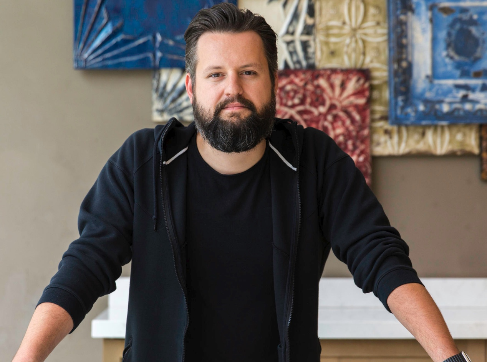

校对翻译了这篇文章，2017-10-25发布于[三节课网站](http://blog.sanjieke.cn/article/3462746)。英文原文地址：[Defining Product Design: A Dispatch from Airbnb's Design Chief](http://firstround.com/review/defining-product-design-a-dispatch-from-airbnbs-design-chief/)

> 这篇文章的作者是Alex Schleifer，爱彼迎的设计副总裁。他曾经是Say Media的高级副总裁兼任创意主管。他同时是Sideshow和UX Magazine（后被收购）的联合创始人。

 

设计师朋友们，我发现我们在一个充满着意外的行业当中。

 

拿爱彼迎的设计团队来说，团队里有前图书管理员、机械工程师、保险代理、理疗师和现代舞舞者。由于对创意和设计的喜爱，他们最终被引导了到了设计这一行。我很欣慰他们做出了这个选择，但是我禁不住想又有多少聪明和有天赋的设计师从这一行流失到了其他行业。我知道这个经常发生，不然我们也不需要经常花很长时间来找合适的设计师了。

 

可能大家听起来会很惊讶，为什么爱彼迎招设计师也这么难，毕竟爱彼迎的两个创始人都是罗德岛设计学院（顶级设计学院）毕业的，而且爱彼迎是一家设计文化驱动的公司。

 

是的，不只是爱彼迎招人很难，我跟苹果、谷歌、脸书和硅谷很多正在不断扩充设计团队的公司聊过，他们也很难。好像现在根本没有足够多的设计师。早期创业公司更是如此，我每周都听说创业或者中型公司天价求设计师而难得的消息。

 

 

尽管这本身是一个人才供给的问题。要求公司等有天赋的设计师自然而然的崭露头角是不现实的，尤其是对于成长路径本来就很不清晰的创业公司来说。

 

所以设计师去哪里找呢？

找一个黑掉一个电视游戏并把它改造并公开在网上的小屁孩儿？

找一个理科专业却碰巧帮他的哥们儿的乐队做了一张星际穿越的宣传海报的学生？

还是去找一个为了给朋友做一个图专门学了下PS的有天赋的插画师？

如果不是因为我妈妈是一个艺术家并且让我相信设计可以成为一个工作，我不会成为设计师。如果没有一条明确的道路指引，我们还是只能靠撞大运的方式发现下一代有天赋的设计师。

 

在讨论企业怎么为设计从业者提供一个舒适的环境和更确定的职业道路前，我觉得聊一聊什么在拖设计行业后腿可能会更有帮助：

 

1.设计师这个角色对社会缺少宣传和教育
 

提起设计，可能有人会知道UI/UX，但是对比产品类的其他同行，设计一直默默无闻。

尽管现在品牌和营销类的设计越来越有名。但是产品设计，尤其是交互设计，一直没有很好的被知晓。对于一个致力于在于设计和定义数字产品的使用体验的角色来说，产品设计能够对人们的日常生活有很大的影响。这样的角色需要被更多的认知和理解，才能让他们为公司讲更好的故事。

 

2.非标准化的组织结构。
 

工程师和产品经理往往有明确的汇报路线，但是不同的公司对于设计师组织的设置都不尽相同。有的类“外包模式”，意味着设计师不深入到组织中，仅仅以项目成员的身份加入到一个又一个项目。这种方式对于公司来说是一种轻松之选，因为这能够帮助设计组在任何时候融入。

还有的是设计师、工程师和产品leader共同向一个负责人汇报的机制，从而让设计人员能够从头到尾的参与项目。甚至还有设计师向产品、工程师或者市场部leader汇报的情况。如果设计师们能够早日联合起来，建立起一套稳定标准有效的设计师组织结构形式。公司的设计文化会更容易形成，同时设计师们的职业发展道路也会更清晰，不管是在一个公司内部或者不同的公司之间。

 

3.领军人物的稀少。
 

工程师出身的比尔·盖茨，马克·扎克伯格，玛丽莎·梅耶尔，产品经理出身的桑达尔·皮查伊（谷歌CEO），雷德·霍夫曼（LinkedIn创始人），凯文·斯特罗姆（Instagram的创始人），这些都成为了行业大拿。但是当问到哪个设计师最后成为了成功创始人或者CEO？我打赌除了乔纳森·伊夫（苹果首席设计师）和Yves Béhar之外你举不出来别人了，并且他们还都是从事工业设计的。

 

也许Joe Gebbia和Brian Chesky也不能算作设计师，他们更多的是Airbnb的创始人。实际上每一个行当最终走出来了多少名人，是一个行业成熟度的风向标，这样的行业也更具有识别度。就像技术领域一直枝繁叶茂走出了很多大拿，当一个行业出现越来越多的领军人物时，它所能够影响的范围也会越来越大。

 

设计师们，如果有一个设计师组成的国家，谁将会出现在我们的百元大钞上呢？

 

 

建立一个设计友好组织的三种方法
 

设计团队组织建设的挑战不在于薪资多少或设定级别高低，而在于这个角色在公司里如何发挥作用。

 

但到目前为止，我们还是摸着石头在过河。设计组织管理的需求一直都在，但是解决这个挑战的路径并不是很清晰，好像似乎又让我们回到了最初提到的人才供给和转化的问题，如果人才不够的需要花时间招聘和培养人才，下面这条是帮助公司吸引人才、帮助设计leader更好的带领团队的建议：

 

一开始就使工程师、产品经理、设计师打成一片
 

在一些科技公司-包括爱彼迎，工程师、产品经理和设计团队会一起组成EPD。设计师参与每个功能的诞生和落地全程。

比如说，在一个项目组中，至少会有EPD每个团队中的一人参与到产品营销和用户反馈的环节中。这种合作模式不光对产品很重要，同时为想要在产品上有所成就的员工提供了更好的职业发展道路。

 

团队合作就像组装一个三脚凳一样，每条腿代表一个部门。如果一开始就像图A一样，每个团队就能够同时发展，最终达到一个令人满意的平衡。

 

我看到的这样做的比较好的公司，都做到了如下两点：

 

-在最开始就招聘一个设计负责人。

这个策略做的最成功的一个公司是Pocket，它用很小的团队就获得了非常让人佩服的增长。当最开始的时候创始人Nate Weiner有工程和设计背景，但是在设计方面并不精通。所以他招了Nikki Will，后来她成为了设计负责人。Weiner评价NIkki的专业在最开始的时候极大的帮助了Pocket成为一个伟大的产品。

 

-同时招聘设计师、工程师和产品经理。

设计师往往只在产品完成、开始开发时加入进行“视觉设计”，这种顺序不仅仅会使UI/UX的决策变得非常复杂，还会改变整个团队的工作模式。临时在组建好的团队中插入一个设计师会打乱团队决策的联调。所以，你最好同步招聘设计师、工程师和产品经理。

你不需要过多的设计师和工程师，只要控制在1：6-1：8之间的比例就很好。不同的产品、团队和公司可以在这个比例上进行微调，但是这个比例将会是一个很好的参考。

 

如果没有一开始实行这套策略的话，你将会得到一个不稳定的团队和不稳定的产品。因为工程师和产品团队都成长起来了，但是设计团队缺失（图C）或者之后才加入（图D）。

避免一个不平衡的椅子（产品）的最好方法就是从一开始就均衡发展。

即一开始就使设计师、工程师和产品经理向同一个老板汇报，或者至少使他们是同级别的。在爱彼迎，这三个团队的leader是同级别的并且都向创始人汇报。这很好的避免了设计仅在产品开发中扮演一个外包角色。

 

这种工程师、产品经理、设计师（EPD）组成的联合领导力不只是在每个部门联合发挥作用，在每个项目上，他们都是这样践行的。以设计智能定价系统为例，这是一个能够为房东预测每天房价的系统。我们需要给房东传递这是一个灵活的、定制化的价格系统。我们使用一个动图来代替简单的加载，让房东感觉到它正在实时计算。设计能够让功能更好的被用户理解，并且能够带来仅靠我们自己研究发现不了的，有价值的用户反馈，从而又推动功能进一步的优化。这种平等自由的跨团队合作模式惊人的提升了产品发展和公司发展的速度。

 

**定义产品的三个关键因素：商业内核、代码质量和每一个像素。**每个部分都需要在关键的产品决策中发声。

 

 

对于爱彼迎的设计团队来说，我们按下面的方法弄清楚设计师如何引导公司的发展，以及我们希望设计职业生涯如何发展。

 

**1.为每一个设计师刻画清晰的职业发展通道**
 

对于贡献突出的个人（ICs）来说-尤其当他们是设计师时，他们经常面对的挑战是个人能力提升了不少甚至到达了一个瓶颈期，而往往他们的管理能力却并不会成长。总的来说，就个人能力、影响力上，ICs不需要过多的支持，但是如何传递他们的才能是一个问题。在爱彼迎，我们用以下方式来帮助他们发展：

 
**- 每个团队都使用一套评级体系。**

不论是工程师、产品经理、设计师、市场人员或销售，都使用同一套职称。他们使用相同的职位组成，每个团队都有初阶和高阶的成员。

**- 使能力突出的个人升职但是不做管理者。**

成为管理者并不意味着升职，这是一套另外的发展体系。能力突出的个人可以在专业技能的职业生涯上一直上升。

 

> 这几条原则能帮助设计师在以下几个方面得到发展：

 

> - 员工留存率。像设计师或者工程师这样的以技术为核心的行业，这能帮助他们一直钻研自己的核心技能而不是为管理他人的发展而烦恼-很多人都因此而离职。同时如果能力突出的个人想要成为管理者时，也需要谨慎考察。

 

> - 全方位的发展。让能力突出者参与更加重要的项目并且做更大的决策时，他们能同时磨炼工程和产品的能力，比单一的工作更加充满挑战，与跨职能部门的同事一起成长。

 

> - 流动性。同样的职级制度给员工更多学习融合行业知识的机会。当一个设计师晋升为高级设计师后，她便能够挑选与她更相称的工程师和产品经理伙伴。在这种更好的工作环境下，设计师甚至有可能改行成为工程师或产品经理。

 

是时候从工业标准开始入手，重新定义设计了。

 

2.使用新工具，建立设计语言系统
 

我不得不承认我始终摆脱不了PS，这就像铅笔和工作台曾经是设计师的第二双手一样。对于着这个使用了20多年的与时俱进的软件，我们已经形成了肌肉记忆。

 

当然，在爱彼迎我们也需要有一批致力于使用先进设计工具的先锋。所以我们成立了一个设计Ops团队（设计工具最佳实践团队），主要是帮助设计团队提升效率。他们来确保设计师们用的工具也能够被工程师、产品经理或者其他职能团队使用。

 

比如说，为了连接开发和视觉设计，Ops开发了一个Sketch插件，它能够自动将最新的Sketch文件同步到任何一个设计师电脑上，防止大家搞不清楚哪份文件是最新修改的。这些小改进不仅仅帮助跨团队写作，同时将设计师从细枝末节中解放出来以便更好的聚焦在创造和设计上。

 

尽管你很难有条件单独组建一支设计Ops团队，但是对于日常使用的工具进行一些小升级会让工作变得更轻松。这是最基础能够做到的：建立一种标准设计语言，并且让大家都使用它。即建立一套设计体系，甚至包括诸如怎样命名文件，如何管理设计版本这样的细节。比起一直在寻找完美的语言来说，每个人都坚持使用一种语言更加重要。

 

坚持使用这种形式成为了我们设计语言体系（DLS）的基础，这不仅仅是关于icon选择或者设计风格，这是由设计师和开发者共同打造的一个体系。DLS的一个核心目标就是设计师和开发者共同定义组件，一旦被定义，这些组件会在iOS，安卓，Reactive Native和网页版本上更新。尽管这些组件建立在不同的开发环境中，在全公司内，他们的名字和核心作用是一模一样的。

youtube 链接：
<iframe width="560" height="315" src="https://www.youtube.com/embed/-SAZKOEWPM4" frameborder="0" allow="autoplay; encrypted-media" allowfullscreen></iframe>
 

当这些体系连接起来之后，整个公司形成了一个横跨所有领域的共享词典。这不仅仅提升了沟通的效率，同时能够更好的吸纳公司其他成员对设计过程的想法。像原生组件浏览器和Airshots这些本地化的成果，使全世界的爱彼迎员工能够随时查看任何可能的屏幕效果。

 

即每一个员工都能看到每个版本的APP在多种语言多种屏幕设备上的展示。有了这个可视化的系统，我们对于整个软件的运行更加一目了然。对于设计师来说，这意味着我们消除了设计和最终产品间抽象的隔板，并且能减少阻塞和疑惑。这帮助每个人都更好的聚焦在自己对这个伟大产品的贡献上。

 

**3.最后的的建议，尽早让团队开始了解和测试新的工具和工作方法，他们需要一些时间来适应。**
 

从设计学院毕业的学生似乎不太适应这套玩法。如果学校在教学生新工具这件事情上做的很差的话，一旦他们毕业加入创业公司肯定会受到不小的打击。因为设计师们是不会喜欢改变他们原来使用的工具的。

如果设计学院能够在学生上学的时候，多给他们一些工具的选择和引导，这样他们会对工具使用更加的灵活而且有更强的适应能力。

 

关于工具的使用，设计师可以在工程师这儿学到不少，毕竟编程工具和语言变化速度实在是太快了。为了在竞争激烈的市场中快速编码并上传代码，他们的改变是如此迅速。

 

有的公司有成千上万的工程师使用一个共享的代码库编码并且相互的代码能够稳定的协同，像鱼群一样能够快速往一个方向走。尽管作为设计师，我们现在在工具和语言上还不能达到这么高的协同程度，但是我们可以从现有的工具开始尝试着做实验，而且在没有工具的时候主动去创造。

 

但是有趣的是，扩展我们的工具集仅仅是使我们在工作中沟通标准化的一个强制手段。这个行业设计中的通用语言能引导我们发展设计行业本身。例如，大家都知道线框图和原型，但是当真正建模和被改变的时候，他们是非常不一样的，比如高保真线框图和低保真原型。同样的道理，模型、组件、元素都被不同的公司赋予了不同的定义。

 

如果能够有一套通用的标准，设计师就能自信和准确的表达他们想要表达的，因为他们知道他们说的也会被准确的被理解。如果没有统一的标准，设计师在每次换工作时都需要重新学习每个公司不同的标准。一套行业标准术语能够帮助我们不受拘束的加速设计行业的发展。在爱彼迎，我们不仅在界面设计上建立了标准，同时希望为行业设计一致的语言。我们希望看到未来和Google、Facebook、IDEO和世界上的公司一起建立行业标准。我们正在向外部分享我们的设计哲学，希望加快这样的对话和合作。

 

字典里充满了固定的词语，但其中包含了诗歌所需要的一切元素。

 

 

也许正因为设计是视觉化的，所以它饱含着浪漫主义。

 

我们能准确的把握色彩、字体、动效和插图，但是我们忽视了我们可以有一个坚定的后盾来保证我们有一个更职业的姿态。每当有新的工具发现时，无论是制片过程还是硬件的升级，电影行业就会举办峰会。我并不喜欢参加那些只是讨论所谓的灵感和创造的活动，而是更喜欢参加一些能够深入讨论帮助设计师更好的发挥的工具及流程的峰会中。

 

设计也可以为了优雅而纯粹的标准而奋斗，我这种设计师看到新工具和新标准的时候能够跟看到故事板一样发光。这些标准可以让工程师和产品经理与设计师无缝对接工作和高效沟通，尽管有一些步骤可能跟传统的设计流程冲突。我们应该关注那些喜欢发挥创造力的设计师，也更应该关注那些将图片剪切成矢量图以用于iOS系统上能节省一些储存空间的设计师。很少有设计师会觉得这些最佳实践和技术上的实现方法有意思，但是我觉得设计师们应该了解，这是为了各位所服务的公司好，也是为了我们这个行业的进步。

 

魔术背后自有机关，未来的设计既需要魔术师也需要那些设计机关的人。

